# Run Conduktor Platform locally with auth0

This example run conduktor-platform using an Oauth2 SSO configuration providing users for login.

<!-- TOC -->
* [Run Conduktor Platform locally with auth0](#run-conduktor-platform-locally-with-auth0)
  * [Requirements](#requirements)
  * [Configuration](#configuration)
    * [Auth0](#auth0)
    * [Okta](#okta)
    * [Keycloak](#keycloak)
    * [Azure](#azure)
<!-- TOC -->


## Configuration

### Auth0
Configure a new Application on Auth0 :

- **Step 1**: create regular web application
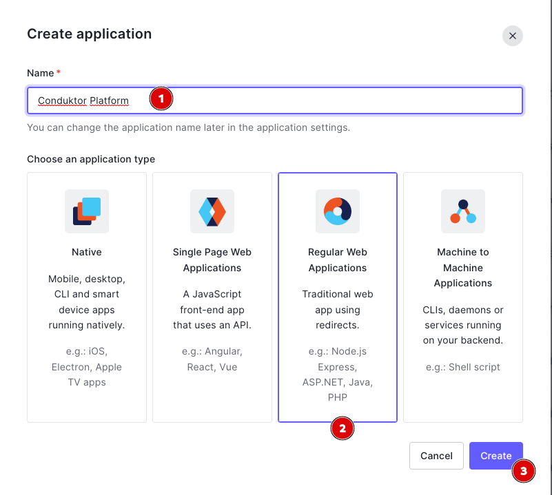

- **Step 2**: get client Id/Secret and domain
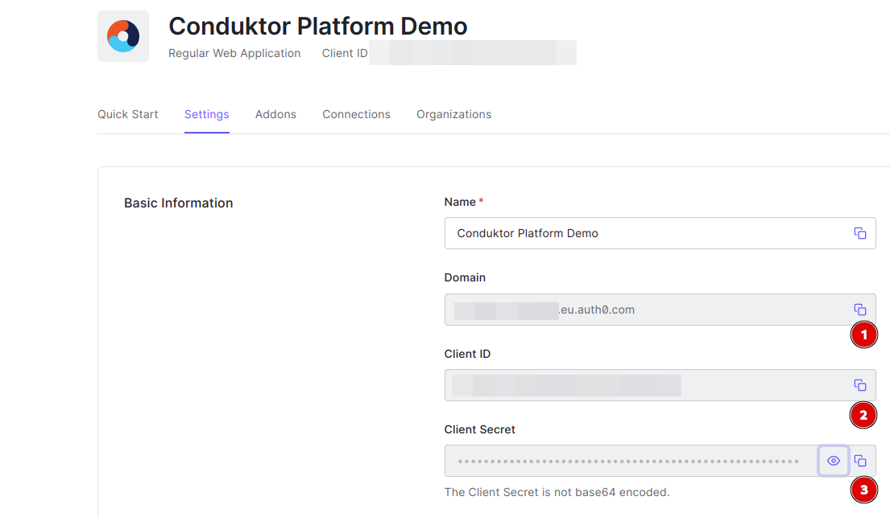

- **Step 3**: configure callback url
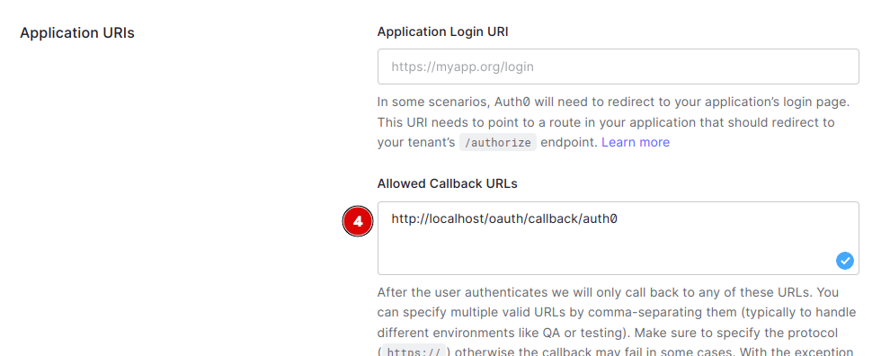

> Note: Conduktor platform expose a callback URI for Oauth2 authentication flow. 
>This URL is defined as `http://<platform hostname>/oauth/callback/<oauth2 config name>`.

- **Step 4**: save changes
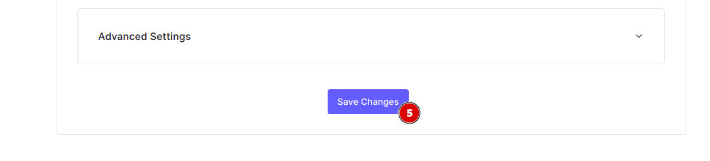

Platform configuration : 
Add the following yaml fragment to your input `platform-config.yml` file. See [here](../doc/Configuration.md) for platform configuration.
```yaml
sso:
  oauth2:
    - name: "auth0"
      default: true
      client-id: "<auth0 app client id>"          # Get from step2 - 2
      client-secret: "<auth0 app client secret>"  # Get from step2 - 3
      openid:
        issuer: "<auth0 app domain>.auth0.com"    # Get from step2 - 1 
```

### Okta
Configure a new Application on Okta :

- **Step 1**: create OpenId Connect web application
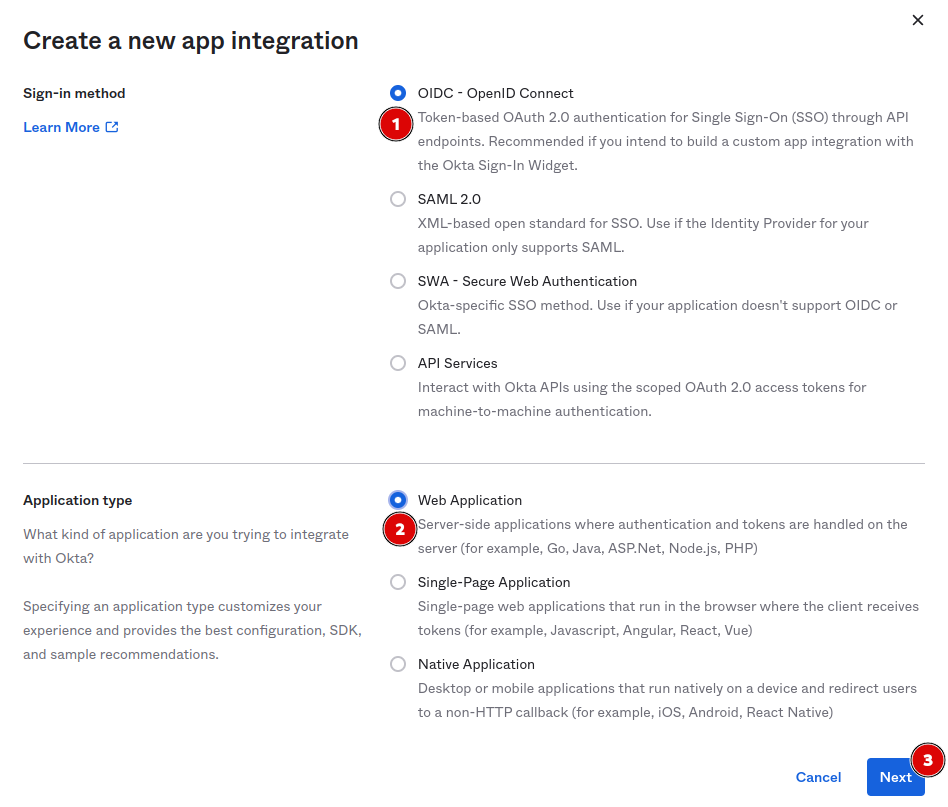

- **Step 2**: configure callback url
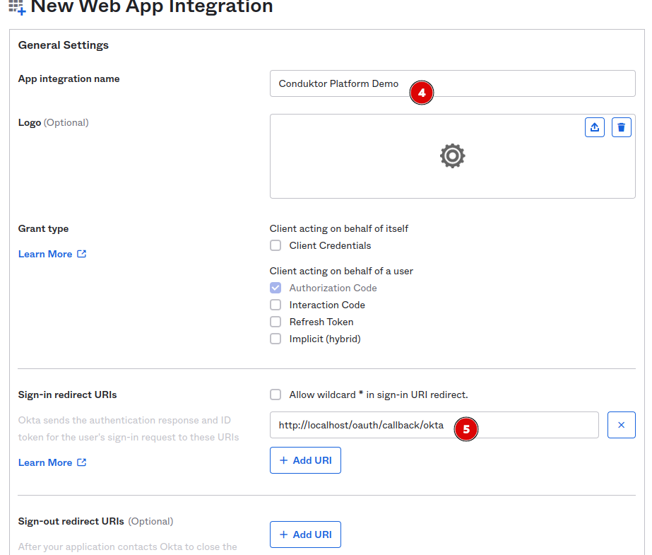

> Note: Conduktor platform expose a callback URI for Oauth2 authentication flow. 
>This URL is defined as `http://<platform hostname>/oauth/callback/<oauth2 config name>`.

- **Step 3**: configure app assignment and save changes
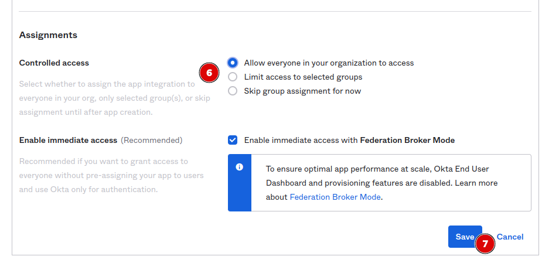

- **Step 4**: Get client Id/Secret
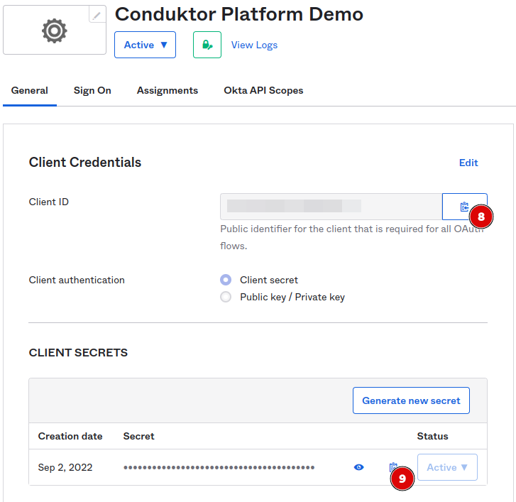

Platform configuration :
Add the following yaml fragment to your input `platform-config.yml` file. See [here](../doc/Configuration.md) for platform configuration.
```yaml
sso:
  oauth2:
    - name: "okta"
      default: true
      client-id: "<okta app client id>"          # Get from step4 - 8
      client-secret: "<okta app client secret>"  # Get from step4 - 9
      openid:
        issuer: "<okta domain>.okta.com"         # Your okta domain
```

### Keycloak
Configure a new client on Keycloak :

- **Step 1**: create new OpenId Connect client
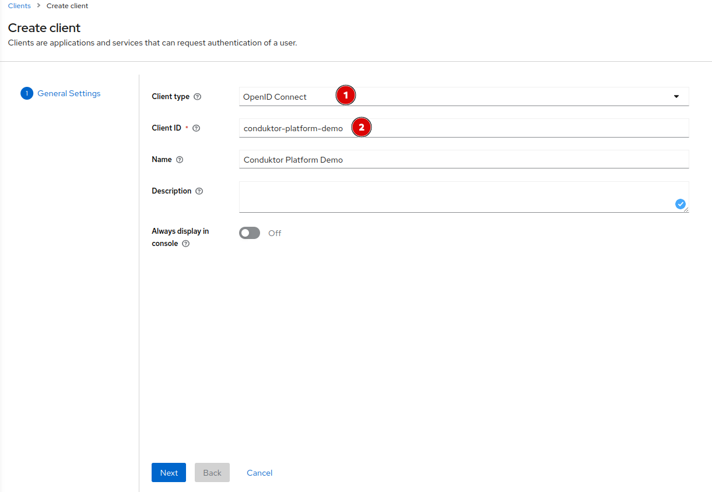


- **Step 2**: Select Client auth flows 
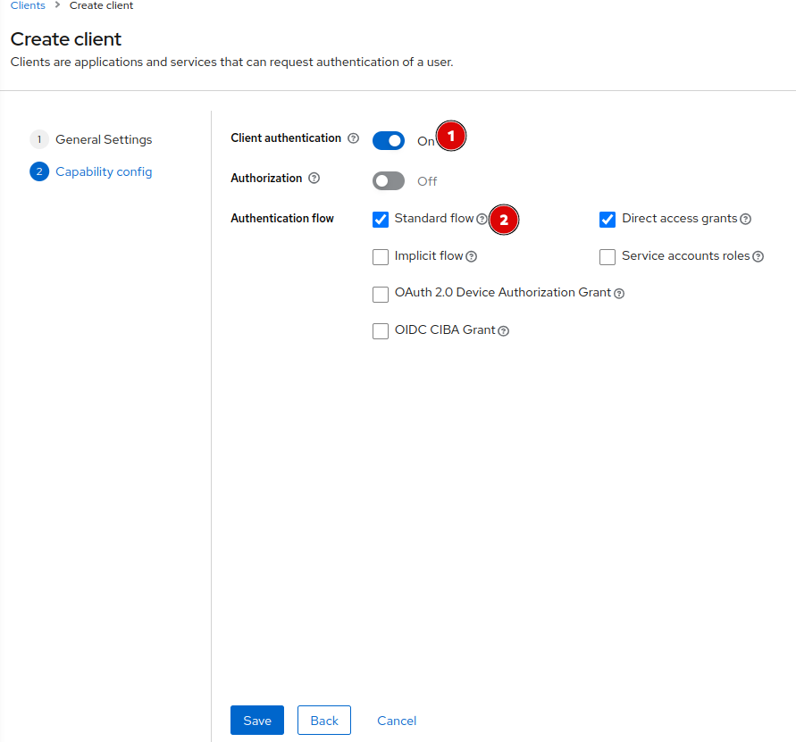


- **Step 3**: Configure redirect url 
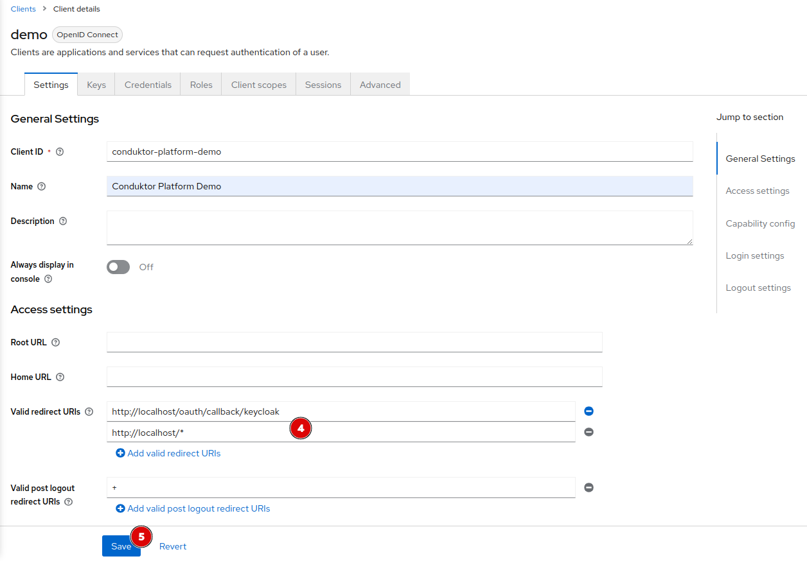

> Note: Conduktor platform expose a callback URI for Oauth2 authentication flow. 
>This URL is defined as `http://<platform hostname>/oauth/callback/<oauth2 config name>`.

- **Step 4**: Get client secret
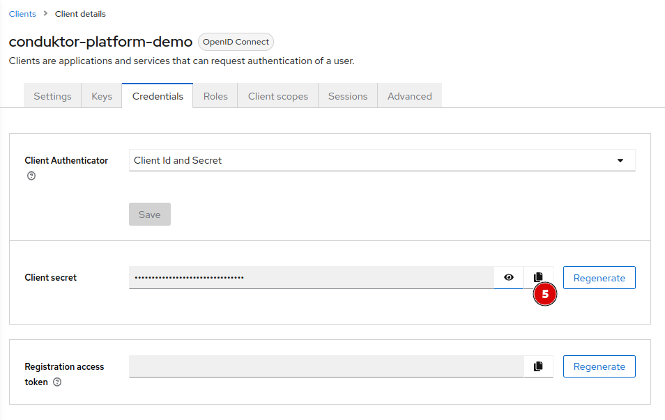


Platform configuration : 
Add the following yaml fragment to your input `platform-config.yml` file. See [here](../doc/Configuration.md) for platform configuration.
```yaml
sso:
  oauth2:
    - name: "keycloak"
      default: true
      client-id: "<keycloak client id>"                    # Created step 1 - 2
      client-secret: "<keycloak client id>"                # Get from step 4 - 5
      openid:
        issuer: "http://<host(:port)>/realms/<realm name>" # Could be get from the OpenI Endpoint configuration (.well-known) output on Realm settings page.
```

### Azure
Configure new application on MS Azure

- **Step 1**: Create a new application in `App registrations`
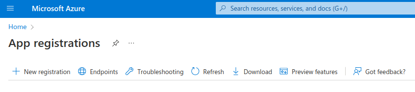

- **Step 2**: Name the application with a relevant name
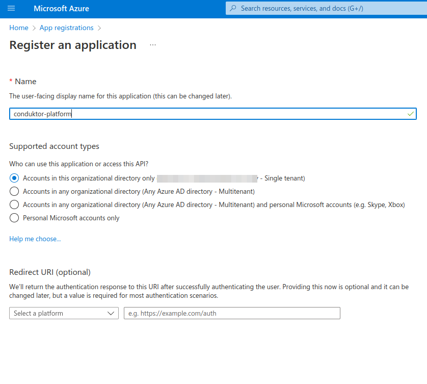

- **Step 3**: Create a new client secret. Keep these details secret.
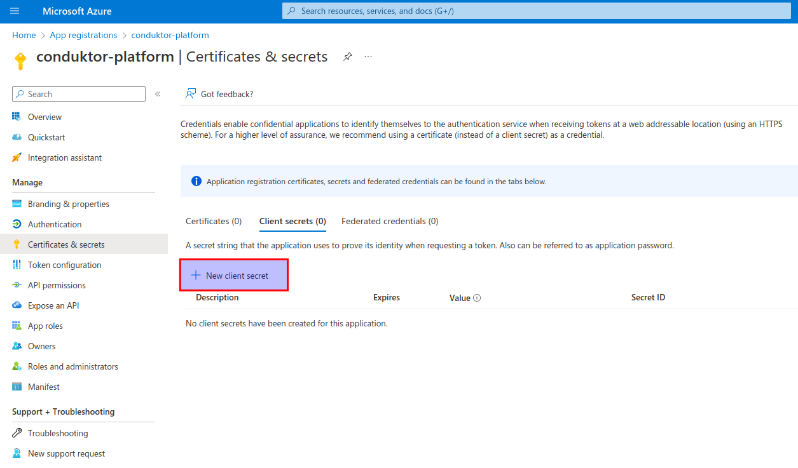

- **Step 4**: Define the callback URL. Either use the full domain you will use to host the application, or `localhost`
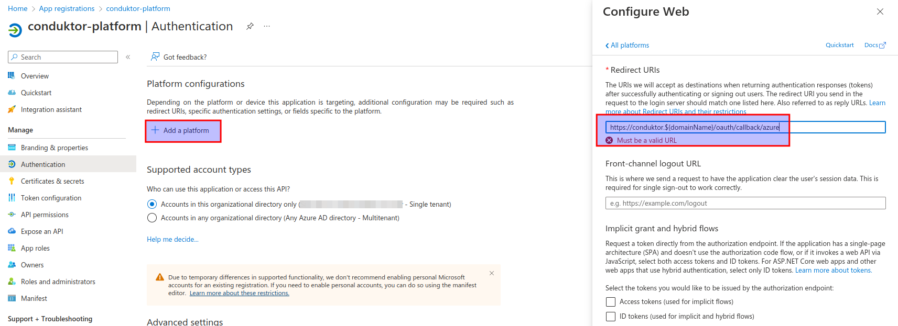

In your application summary, you can easily find the tenant ID of your organization in MS Azure.
Replace the `{tenantid}` in the below configuration for `openid`.
Use the application ID as the `client-id`, and the client secret you created earlier as `client-secret`

```yaml
sso:
  oauth2:
    - name: "azure"
      default: true
      client-id: ${AZURE_APPLICATION_ID}
      client-secret: ${AZURE_CLIENT_SECRET}
      openid:
        issuer: https://login.microsoftonline.com/{tenantid}/v2.0
```

Note: do not use the "Secret ID" of the client secret as the `client-id`. You **must** use the application ID.
